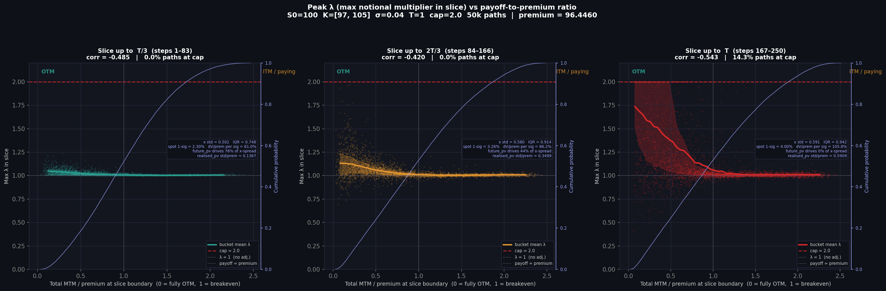
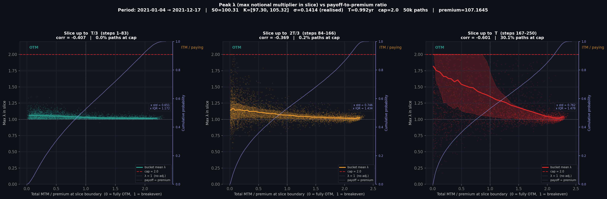

# RampStripVolLock

Monte Carlo analysis of a **ramp-strip vol-lock** structure: a strip of
short-dated mini call-spreads ("ramps") with a dynamic notional multiplier λ
that adjusts the hedge account when it drifts away from the strip's fair value.

---

## Structure overview

A **ramp strip** consists of N call-spreads, each expiring at equally-spaced
times t_i = i·dt (i = 1…N, last expiry = T). Each spread has notional 1/dK,
so as dK → 0 the strip converges to a corridor density: the client receives
the integral of spot inside [K_lo, K_hi] over time.

The **vol-lock** mechanism re-scales the hedge notional by λ at each step to
keep the hedge account tracking the strip's mark-to-market. λ is capped at a
configurable maximum to limit over-hedging on deeply OTM paths.

---

## Repository layout

```
ramp_strip.py                   Black-Scholes pricing of a single ramp
                                (call-spread) and a strip of N ramps.
                                Exposes: price, spot delta, strike delta.

ramp_hedging.py                 Builds on ramp_strip.py.
                                  RampStripPayoff  – strip with 1/dK notional,
                                                     realised & future PV methods.
                                  DeltaHedgingSimulation – GBM MC engine; stores
                                                     full per-path, per-step history
                                                     of MTM, lambda, hedge account.
                                  plot_simulation  – four-panel diagnostic figure.

_cap_sweep.py                   Sweep over lambda cap values; tabulates hedge-
                                account P&L statistics (std, VaR, CVaR, % capped).

_cap_hero.py                    Hero chart: hedge-account distribution for
                                several cap levels on one figure.

_resilience_sweep.py            2-D grid sweep over (cap, retention); shows how
                                client-side retention interacts with the cap.

_lambda_payoff_scatter.py       Scatter / hexbin: mean λ adjustment vs client
                                payoff at maturity. Confirms λ spikes on OTM paths.

_lambda_timeslice_scatter.py    3-panel scatter: peak λ within each time-slice
                                vs total MTM/premium at the slice boundary.
                                Includes per-panel MTM decomposition annotation
                                (future_pv vs realised_pv contribution).

_lambda_timeslice_scatter_csv.py  CSV-driven version of the above. Reads a
                                date/value price series, splits it into non-
                                overlapping CHUNK_SIZE-day windows, estimates
                                per-chunk σ and S0, and produces one PNG per
                                chunk. CONFIG block at the top of the file.

test_prices.csv                 Synthetic 1 000-row daily price series (4 × 250
                                trading days, four volatility regimes) for testing
                                the CSV-driven script.
```

---

## Quick start

```bash
python -m venv .venv
.venv\Scripts\activate          # Windows
pip install -r requirements.txt

# Fixed-parameter scatter analysis
python _lambda_timeslice_scatter.py
# → lambda_timeslice_scatter_safe.png

# CSV-driven analysis (edit CONFIG at the top of the file first)
python _lambda_timeslice_scatter_csv.py
# → lambda_timeslice_csv_chunk01_<dates>.png  (one file per chunk)

# Cap sweep
python _cap_sweep.py

# Resilience sweep
python _resilience_sweep.py
```

All scripts write PNG output to the working directory and print a summary
table to stdout. No arguments are needed; all parameters are in the CONFIG /
setup block at the top of each file.

---

## Key parameters (`_lambda_timeslice_scatter.py`)

| Parameter | Default | Description |
|---|---|---|
| `S0` | 100 | Initial spot |
| `K_lo` / `K_hi` | 97 / 105 | Corridor strikes |
| `sigma` | 0.04 | Implied / realised vol |
| `T` | 1 | Maturity (years) |
| `N` | 250 | Steps (one per trading day) |
| `CAP` | 2.0 | Maximum λ multiplier |
| `N_PATHS` | 50 000 | Monte Carlo paths |
| `b1`, `b2` | N//3, 2N//3 | Time-slice boundaries |

## Key parameters (`_lambda_timeslice_scatter_csv.py`)

| Parameter | Default | Description |
|---|---|---|
| `CSV_PATH` | `test_prices.csv` | Input price series |
| `DATE_COL` / `VALUE_COL` | `date` / `value` | Column names |
| `CHUNK_SIZE` | 250 | Trading days per chunk |
| `K_LO_FRAC` / `K_HI_FRAC` | 0.97 / 1.05 | Strikes as fraction of chunk S0 |
| `R`, `Q` | 0.035 | Risk-free rate / dividend yield |
| `CAP` | 2.0 | Maximum λ multiplier |
| `N_PATHS` | 50 000 | Monte Carlo paths per chunk |

Per-chunk σ is estimated from the annualised realised volatility of
log-returns within that window.

---

## MTM decomposition note

At early time-slices the x-axis ("total MTM / premium") is dominated by the
**mark-to-market of the remaining unborn ramps**, not by realised payoffs.
Because the strip has a large dollar-delta (1/dK notional scaling), even a
sub-1% spot move in 12 days can shift the future strip value by ~20% of
premium. Each panel's annotation box breaks this down:

- `spot 1-sig` — cumulative σ√t at the slice boundary
- `dV/prem per sig` — first-order MTM change per 1-sigma spot move as % of premium
- `future_pv drives N%` — fraction of x-spread attributable to the future component
- `realised_pv std/prem` — tiny residual from the handful of expired ramps

---

## Sample output




